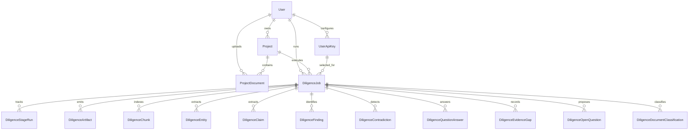

# Database Structure

## Prisma Setup

This project uses Prisma 7 with the `prisma-client` generator and a multi-file schema:

- Root config: `prisma/schema.prisma` (generator + datasource)
- Domain models: `prisma/models/*.prisma`
- Runtime client output: `lib/generated/prisma/`

Database access is centralized through `lib/db.ts` using `PrismaPg` adapter.

## Schema Domains

### 1) Identity + Auth

From `prisma/models/user.prisma` and `prisma/models/auth.prisma`:

- `User`
- `Account`
- `Session`
- `VerificationToken`

Purpose:
- Application identity and login/session state for Auth.js.

### 2) Project Workspace

From `prisma/models/project.prisma` and `prisma/models/project-document.prisma`:

- `Project`
- `ProjectDocument`
- enum `ProjectStatus`
- enum `ProjectDocumentProcessingStatus`

Purpose:
- Represents a diligence workspace (`Project`) and uploaded source files (`ProjectDocument`).

Key points:
- `Project` belongs to one `User`.
- `ProjectDocument` stores file metadata/pathname and processing state.
- Cascade delete removes project children when a project is deleted.

### 3) API Key Management

From `prisma/models/api-key.prisma`:

- `UserApiKey`
- enum `ApiKeyProvider` (`OPENAI`, `ANTHROPIC`, `GOOGLE`)

Purpose:
- Encrypted per-user model credentials and provider defaults.

### 4) Diligence Execution and Outputs

From `prisma/models/diligence.prisma`:

- Execution control:
  - `DiligenceJob`
  - `DiligenceStageRun`
  - enums `DiligenceJobStatus`, `DiligenceStageName`, `DiligenceStageStatus`
- Input/output artifacts:
  - `DiligenceArtifact`
  - `DiligenceChunk`
  - enums `DiligenceArtifactType`, `DiligenceStorageProvider`
- Analytical entities:
  - `DiligenceEntity`
  - `DiligenceClaim`
  - `DiligenceFinding`
  - `DiligenceContradiction`
  - enums `DiligenceFindingType`, `DiligenceClaimStatus`
- Structured question framework:
  - `DiligenceQuestionAnswer`
  - `DiligenceEvidenceGap`
  - `DiligenceOpenQuestion`
  - `DiligenceDocumentClassification`
  - enum `DiligenceCoreQuestion`

Purpose:
- Tracks staged pipeline progress and persists all generated diligence intelligence.

## Entity Relationship Overview



## Indexing and Query Patterns

Important index patterns in current schema:

- Job retrieval and queueing:
  - `DiligenceJob @@index([projectId, createdAt])`
  - `DiligenceJob @@index([status, priority])`
- Stage run lookups:
  - `DiligenceStageRun @@unique([jobId, stage])`
- Project-oriented analysis reads:
  - model-level indexes on `projectId`, `jobId`, and status/type fields.

These support:
- "latest job for project"
- "stage-by-stage progress"
- "latest completed outputs for project"
- "user-scoped project and evidence reads"

## Design Decisions

- `userId` is duplicated across child diligence tables intentionally:
  - allows direct row-level filtering by user without mandatory joins through `Project`/`DiligenceJob`.
- JSON fields are used for opaque structured outputs and references:
  - `metadata`, `chunkRefs`, `evidenceRefs`, `structured`, `outputJson`.
- Heavy text (`DiligenceChunk.text`) and outputs are stored in DB for deterministic replay and enquiry grounding.

## Migration / Generate Commands

After changing schema files:

```bash
yarn prisma generate
yarn prisma migrate dev
```
